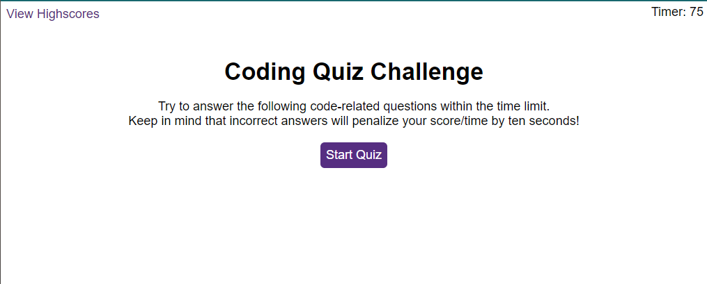

## Table of contents
​
- [Overview](#overview)
  - [The challenge](#the-challenge)
  - [Screenshot](#screenshot)
  - [Links](#links)
- [My process](#my-process)
  - [Built with](#built-with)
  - [What I learned](#what-i-learned)
  - [Continued development](#continued-development)
  - [Useful resources](#useful-resources)
- [Author](#author)
- [Acknowledgments](#acknowledgments)
​
**Note: Delete this note and update the table of contents based on what sections you keep.**
​
## Overview
​
### The Challenge
​
Users should be able to:
​
- AS A coding boot camp student
- I WANT to take a timed quiz on JavaScript fundamentals that stores high scores
- SO THAT I can gauge my progress compared to my peers

Acceptance Criteria:

- GIVEN I am taking a code quiz
- WHEN I click the start button
- THEN a timer starts and I am presented with a question
- WHEN I answer a question
- THEN I am presented with another question
- WHEN I answer a question incorrectly
- THEN time is subtracted from the clock
- WHEN all questions are answered or the timer reaches 0
- THEN the game is over
- WHEN the game is over
- THEN I can save my initials and my score

​
### Screenshot
​

​

​
### Links
​
- Solution URL: [https://github.com/AveryCaldwell/code-quiz-web-APIs](https://github.com/AveryCaldwell/code-quiz-web-APIs)
- Live Site URL: [https://averycaldwell.github.io/code-quiz-web-APIs/](https://averycaldwell.github.io/code-quiz-web-APIs/)
​
## My process
​
### Built with
​
- Semantic HTML5 markup
- CSS custom properties
- JavaScript
- Web APIs
- Git/Git pages


​
### What I learned
​
- While working on this project, I learned how to use on click events in order to proceed with the next question of the quiz. 
- I learned how to consolidate code in order to prevent redundant JavaScript and make it easier to read.
- In regard to localStorage, I learned that the `JSON.stringify` method converts a Javascript value to a JSON string. In order to store data in local storage, the data must be in "text" format.
​
```html
        <section id="quiz">
            <h2 id="quizQuestion"></h2>
            <button id="answerBtn0" class="optionBtn"></button><br>
            <button id="answerBtn1" class="optionBtn"></button><br>
            <button id="answerBtn2" class="optionBtn"></button><br>
            <button id="answerBtn3" class="optionBtn"></button>
            <p id="result"></p>
        </section>
```
- ​I am proud of this code because I was able to store all of the questions and answers inside the JavaScript file.
​
```js
const hideSections = function () {
  homepage.style.display = "none";
  quiz.style.display = "none";
  results.style.display = "none";
  scores.style.display = "none";
};
```
- This is an example of consolidating code to avoid redundancy and make it easier to find information.
​
```js
quizStart.addEventListener("click", function () {
  currentQuestion = 1;
  activeSection("quiz");
});
```
- This on c​lick event displays the section as visible and shows the first question.


### Continued development
​
I am still not completely comfortable using timers and intervals. I want to further my understanding because the interval method has many uses, including repeating blocks of code multiplle times or creating a clock with a timing event.
​
​
### Useful resources
​
- [https://developer.mozilla.org/en-US/docs/Web/API/KeyboardEvent](https://developer.mozilla.org/en-US/docs/Web/API/KeyboardEvent) - This helped me for keyboard events such as keydown. I really liked the examples given and will reference it going forward.
- [https://developer.mozilla.org/en-US/docs/Web/API/Document/createElement](https://developer.mozilla.org/en-US/docs/Web/API/Document/createElement) - This article helped me get a better understanding of `Document.createElement()`. I'd recommend it to anyone still learning this concept.
​

## Author
Avery Caldwell
- GitHub - [AveryCaldwell](https://github.com/AveryCaldwell)
​
